<p align="center">
  
  
  
  
</p>

# 🔐 Secure Container Access Manager (SCAM)

> **Enterprise-grade security wrapper for Docker container access with authentication, role-based access control (RBAC), and comprehensive session auditing.**

---

## 📖 Table of Contents

- [Overview](#-overview)
- [Key Features](#-key-features)
- [System Architecture](#-system-architecture)
- [Technology Stack](#-technology-stack)
- [Installation](#-installation)
- [Usage](#-usage)
- [Database Schema](#-database-schema)
- [Security Model](#-security-model)
- [Project Structure](#-project-structure)
- [Troubleshooting](#-troubleshooting)
- [License](#-license)

---

## 🎯 Overview

**Secure Container Access Manager (SCAM)** is a Python CLI tool designed to provide enterprise-level security for Docker container environments. It restricts direct Docker access and enforces all container interactions through a secure, authenticated wrapper.

### 🔑 Core Capabilities

| Feature | Description |
|---------|-------------|
| 🔒 **Authentication** | Secure login with bcrypt password hashing |
| 👥 **RBAC** | Admin and user role management with distinct permissions |
| 🐳 **Container Ownership** | Automatic container claiming and ownership tracking |
| 📹 **Session Recording** | Complete audit trail with typescript recording |
| 📊 **Access Logging** | Comprehensive logs of all container access events |

---

## ✨ Key Features

### 🔐 Security
- **Password Hashing**: Uses `bcrypt` with salt for secure password storage
- **Docker Socket Lockdown**: Restricts `/var/run/docker.sock` to root-only access
- **Group-Based Restrictions**: Removes users from `docker` group to prevent bypass
- **Sudoers Policy**: Allows only wrapper script execution via sudo

### 👤 Access Control
- **Role-Based Access**: Separate admin and user roles with granular permissions
- **Container Ownership**: Users can claim and own containers exclusively
- **Atomic Operations**: Transaction-based container claiming prevents race conditions

### 📝 Auditing
- **Session Recording**: Full terminal session capture using `script` command
- **Access Logs**: Timestamped records of all container access events
- **Audit Trail**: Complete history stored in SQLite database

---

## 🏗️ System Architecture

### High-Level Architecture

```mermaid
graph TB
    subgraph Users["👥 USERS"]
        A["🔑 Admin"]
        B["👤 Regular User"]
    end
    
    subgraph SCAM["🔐 SECURE CONTAINER ACCESS MANAGER"]
        C["Authentication Layer"] --> D["RBAC Engine"]
        D --> E["Container Ownership"]
        E --> F["Session Recording"]
    end
    
    subgraph Storage["💾 STORAGE LAYER"]
        G[("SQLite Database")]
        H["Session Logs"]
    end
    
    subgraph Docker["🐳 DOCKER ENGINE"]
        I["Containers"]
        J["🔒 Docker Socket (Locked)"]
    end
    
    A --> C
    B --> C
    C --> G
    E --> G
    F --> H
    F --> I
    J --> I
    
    style A fill:#4CAF50
    style B fill:#2196F3
    style C fill:#FF9800
    style D fill:#FF9800
    style E fill:#FF9800
    style F fill:#FF9800
    style G fill:#9C27B0
    style H fill:#9C27B0
    style I fill:#00BCD4
    style J fill:#f44336
```



### Authentication Flow

```mermaid
sequenceDiagram
    participant U as 👤 User
    participant E as 🔐 enter.py
    participant D as 💾 Database
    participant K as 🐳 Docker
    
    U->>E: 1. Run access command
    E->>U: 2. Prompt credentials
    U->>E: 3. Enter user/password
    E->>D: 4. Verify credentials
    D->>E: 5. Auth result
    E->>K: 6. Check container status
    K->>E: 7. Container running
    E->>D: 8. Claim/verify owner
    D->>E: 9. Ownership confirmed
    E->>E: 10. Start recording
    K-->>U: 11. Grant access + 📹 Session recorded
    U->>E: 12. Exit container
    E->>D: 13. Log session end
```



### Container Access Flow


---

## 🛠️ Technology Stack

| Component | Technology | Purpose |
|-----------|------------|---------|
| **Language** | Python 3.7+ | Core application logic |
| **Database** | SQLite | User, container, and log storage |
| **Security** | bcrypt | Password hashing |
| **Container** | Docker SDK | Container management |
| **Recording** | script/pty | Session capture |
| **Platform** | Linux (systemd) | System integration |

---

## 🚀 Installation

### Prerequisites

- **Linux system** (Ubuntu 20.04+ recommended, requires systemd)
- **Python 3.7+** (Python 3.12+ requires `python3-full` package)
- **Docker Engine** installed and running
- **sudo/root access** for initial setup

### Step-by-Step Installation

```bash
# 1️⃣ Clone the repository
git clone https://github.com/MUHSIN-M-P/Secure-Container-Access-Manager.git
cd Secure-Container-Access-Manager

# 2️⃣ Install system dependencies (Ubuntu/Debian)
sudo apt update
sudo apt install python3-full python3-pip docker.io
sudo systemctl start docker
sudo systemctl enable docker

# 3️⃣ Create virtual environment
python3 -m venv venv
source venv/bin/activate
pip install -r requirements.txt

# 4️⃣ Verify Docker connectivity
python3 src/check_docker.py

# 5️⃣ Run setup with sudo (IMPORTANT: use venv's Python)
sudo ./venv/bin/python3 setup.py
```

### What Setup Does

| Step | Action |
|------|--------|
| ✅ | Creates system directories (`/var/lib/secure-container-access`, `/var/log/secure-container-access`) |
| ✅ | Locks Docker socket to root-only access |
| ✅ | Removes all users from `docker` group |
| ✅ | Creates `developers` group and adds users |
| ✅ | Configures sudoers policy |
| ✅ | Creates first admin account |

> ⚠️ **Important**: All users must log out and back in after setup for group changes to take effect.

---

## 📖 Usage

### For Admins

```bash
# Bootstrap first admin (initial setup)
sudo ./venv/bin/python3 src/admin.py bootstrap

# List all admins
sudo ./venv/bin/python3 src/admin.py list

# Add a new admin
sudo ./venv/bin/python3 src/admin.py add

# Remove an admin
sudo ./venv/bin/python3 src/admin.py remove

# Delete a regular user
sudo ./venv/bin/python3 src/admin.py delete-user
```

### For Users

```bash
# Access a container
sudo ./venv/bin/python3 -m src <container_name>

# Create a new user account
sudo ./venv/bin/python3 src/user.py create

# Delete your own account
sudo ./venv/bin/python3 src/user.py delete
```

---

## 🗄️ Database Schema


### Table Details

| Table | Purpose | Key Fields |
|-------|---------|------------|
| **users** | Store user credentials and roles | `username`, `password_hash`, `role` |
| **containers** | Track container ownership | `container_name`, `owner_username` |
| **access_logs** | Audit trail for all sessions | `ts_start`, `ts_end`, `typescript_path` |

---

## 🔒 Security Model

### Defense in Depth

```mermaid
flowchart TB
    subgraph L1["🛡️ LAYER 1: SYSTEM LEVEL"]
        A1["Docker Socket Locked<br/>(root-only)"]
        A2["Docker Group Empty<br/>(no members)"]
        A3["Sudoers Restricted<br/>(wrapper only)"]
    end
    
    subgraph L2["🛡️ LAYER 2: APPLICATION LEVEL"]
        B1["bcrypt Authentication<br/>(salted hash)"]
        B2["Role-Based Access<br/>(admin/user)"]
        B3["Atomic Transactions<br/>(race-free)"]
    end
    
    subgraph L3["🛡️ LAYER 3: AUDIT LEVEL"]
        C1["Session Recording<br/>(typescript)"]
        C2["Access Logging<br/>(timestamped)"]
        C3["Ownership Tracking<br/>(per-user)"]
    end
    
    L1 --> L2
    L2 --> L3
    
    style L1 fill:#f44336,color:#fff
    style L2 fill:#FF9800,color:#fff
    style L3 fill:#4CAF50,color:#fff
```



### Security Features

| Feature | Implementation | Protection |
|---------|---------------|------------|
| **Password Storage** | bcrypt with salt | Resistant to rainbow table attacks |
| **Socket Lockdown** | systemd drop-in override | Prevents direct Docker access |
| **Group Isolation** | Removes users from docker group | No bypass via group membership |
| **Sudoers Policy** | Whitelist wrapper script only | Restricts sudo capabilities |
| **Atomic Claims** | SQLite transactions | Prevents race conditions |
| **Session Recording** | script/pty capture | Complete audit trail |

---

## 📁 Project Structure

```
Secure-Container-Access-Manager/
├── 📂 src/                      # Source code
│   ├── __main__.py              # Module entry point
│   ├── accounts.py              # User account management (CRUD)
│   ├── admin.py                 # Admin CLI interface
│   ├── check_docker.py          # Docker API connectivity check
│   ├── db.py                    # Database initialization
│   ├── enter.py                 # Container access & authentication
│   └── user.py                  # User self-service operations
│
├── 📂 notes/                    # Project documentation
├── 📄 setup.py                  # System-level security configuration
├── 📄 requirements.txt          # Python dependencies
├── 📄 .gitignore               # Git ignore rules
└── 📄 README.md                # This file
```

### Module Responsibilities

| Module | Description |
|--------|-------------|
| `enter.py` | Main entry point - handles authentication, container access, and session recording |
| `accounts.py` | User management - create, delete, list, verify users |
| `admin.py` | Admin CLI - bootstrap, add/remove admins, manage users |
| `db.py` | Database layer - connection management and schema initialization |
| `setup.py` | System setup - Docker lockdown, sudoers, directory creation |
| `user.py` | User self-service - account creation and deletion |

---

## 🐞 Troubleshooting

<details>
<summary><b>❌ ModuleNotFoundError when running with sudo</b></summary>

```
ModuleNotFoundError: No module named 'docker'
```

**Cause**: `sudo python3` uses system Python, not your venv.

**Solution**:
```bash
sudo ./venv/bin/python3 setup.py
# OR
sudo "$(which python3)" setup.py  # if venv is activated
```
</details>

<details>
<summary><b>❌ Permission denied errors</b></summary>

```
PermissionError: [Errno 13] Permission denied: '/var/lib/secure-container-access'
```

**Solution**: Run setup with sudo using venv's Python.
</details>

<details>
<summary><b>❌ externally-managed-environment error</b></summary>

```
error: externally-managed-environment
```

**Solution (Ubuntu 24.04+)**:
```bash
sudo apt install python3-full
deactivate  # if in venv
rm -rf venv
python3 -m venv venv
source venv/bin/activate
pip install -r requirements.txt
```
</details>

<details>
<summary><b>❌ Docker not found</b></summary>

```
✗ Docker API error: Error while fetching server API version
```

**Solution**:
```bash
sudo apt install docker.io
sudo systemctl start docker
sudo systemctl enable docker
python3 src/check_docker.py  # verify
```
</details>

<details>
<summary><b>❌ Users still have Docker access after setup</b></summary>

**Solution**: Users must log out and log back in for group changes to take effect.
</details>

<details>
<summary><b>❌ Script command not found</b></summary>

The system falls back to basic PTY recording if `script` is unavailable.

**Solution**:
```bash
sudo apt install util-linux
```
</details>

---

## 📊 Summary

| Aspect | Details |
|--------|---------|
| **Purpose** | Secure Docker container access management |
| **Target** | Enterprise/team environments |
| **Platform** | Linux (Ubuntu 20.04+) |
| **Language** | Python 3.7+ |
| **Security** | Multi-layer (system + application + audit) |
| **Database** | SQLite (lightweight, embedded) |
| **Recording** | Full session typescript capture |

---

<p align="center">
  <b>🔐 Secure Container Access Manager</b><br>
  <i>Securing Docker access, one container at a time.</i>
</p>
